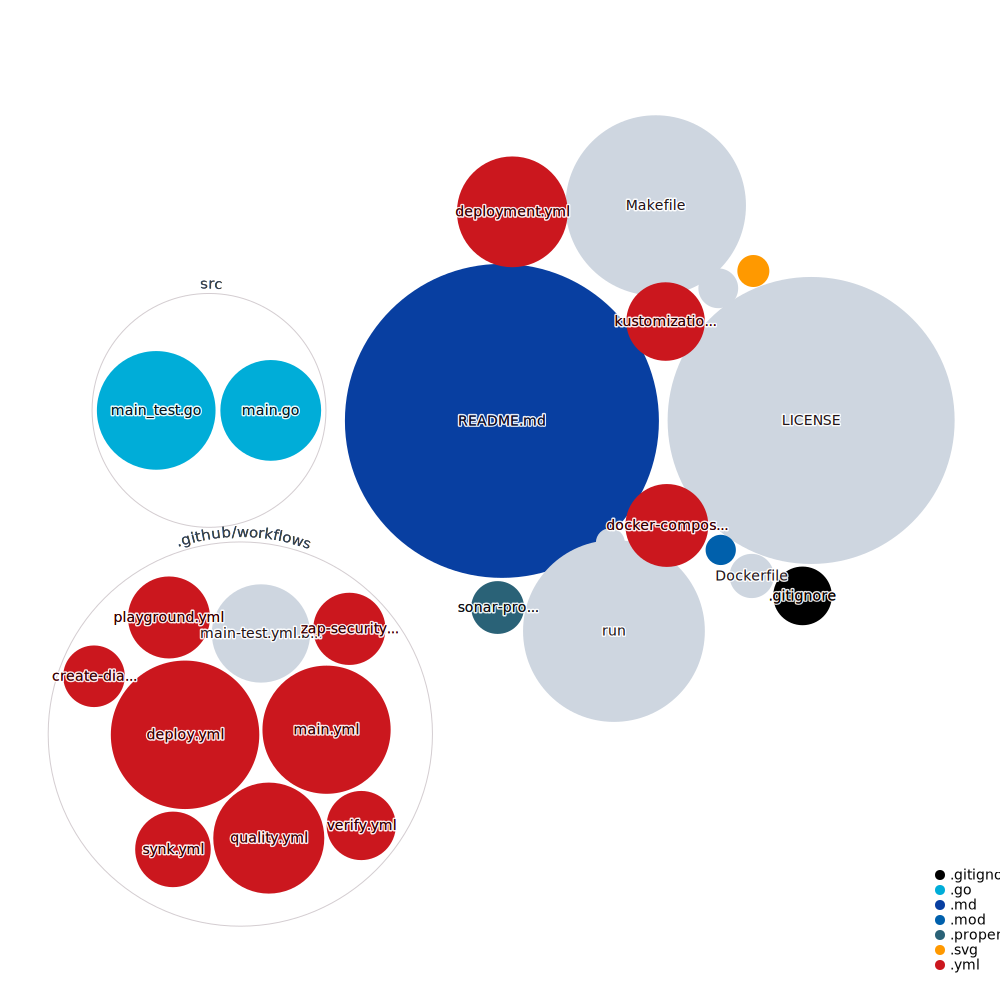

# GSD Hello World

The GSD (Good Software Delivery) "Hello World" app is written in Golang and wrapped in Docker via [3 Musketeers](https://3musketeers.io/).

This repo is a **demo of how you might implement a set of concepts that make up a "Trust and Verify" pipeline**, which is a concept within the practice of GSD.

For more context see [How to implement Good Software Delivery in 30 seconds](https://medium.com/@drew.khoury/how-to-implement-good-software-delivery-in-30-seconds-72d13ad4a296) or these other supporting blogs:

- [GSD](https://medium.com/@drew.khoury/how-cloud-transformation-at-scale-can-enable-good-software-delivery-4a6645d4c570)
- [Trust and Verify](https://medium.com/@drew.khoury/good-software-delivery-trust-and-verify-ced74fa04b39)
- [Developer Experince](https://medium.com/@drew.khoury/optimizing-for-dx-the-developer-experience-f37fe168642d)
- [3 Musketeers](https://medium.com/@drew.khoury/3-musketeers-for-an-epic-developer-experience-8676ddaf33b2)

This repo is a **learning tool** that can help you explore the concepts of GSD & Trust and Verify. The intention is to offer you an implementation that's simple enough for you to get hands-on quickly, with the opportunity to extend it for other use cases, or simply take the learnings into your existing software development for the concepts that apply to your use case.

What this is not:

- A real application
- Something you should copy/paste without reviewing and understanding the code
- The one or only way you should implement these concepts

## Principals

This repo demostrates best practices of `Good Software Delivery` by following these principals:

- All build steps are wrapped in a common interface (for our demo/implementation **we've chosen `Make`** but that doesn't exclude you choosing what's appropriate for your team and organization)
- Execution of each step via Docker images where possible (some shell/API calls have been used in this demo as an exception)
- A single commit results in one artifact (which is immutable)

It's important to note that the use of `Make` is **not to build the software**, but rather it's to act as in interface. Understanding 3 Musketeers is an important part of undertanding why we chose `Make` as an interface between the pipeline and application code. See [3musketeers tools](https://3musketeers.io/about/tools.html) and alternatives, and patterns for a detailed walkthough of other options.

## What this repo does

This hello world app (written in Golang) demonstrates the following features:

- Building an application (`make build`)
- Running an application locally (`make run` then open `http://localhost:8080/` in your browser)
- Testing an application (`make test`)
- Storing properties associated with an application artifact (`make create_table` && `make create_tags`)

See [artifact property storage](https://github.com/contino/gsd-hello-world#artifact-storage) for more info on how and why AWS is used in this demo when deploying artifacts.

### A more detailed look at what this repo does

#### [Makefile](https://github.com/contino/gsd-hello-world/blob/master/Makefile)

Entrypoint that creates and refernces the golang application as a docker image (go-hello-world) via [Dockerfile](https://github.com/contino/gsd-hello-world/blob/master/Dockerfile). It's used for `build` and `run` actions.

Calls compose to drive the `test` action, and `create_table` / `create_tags` which work as a very basic artifact storage demo.

Ideally all/most/more of the actions would be driven out of the compose file to further simplify the Makefile.

#### [Dockerfile](https://github.com/contino/gsd-hello-world/blob/master/Dockerfile)

The dockerfile is based on [FROM golang:latest](https://hub.docker.com/_/golang) which is an official image. Our Dockerfile aims to offer the most simple implementation of building the application for the purposes of running a demo.

#### [docker-compose.yml](https://github.com/contino/gsd-hello-world/blob/master/docker-compose.yml)

Images used:

- `gohelloworld` build via [Dockerfile](https://github.com/contino/gsd-hello-world/blob/master/Dockerfile)
- [golang](https://hub.docker.com/_/golang) official image - also used as base for `gohelloworld` and for other actions
- [amazon/aws-cli](https://hub.docker.com/r/amazon/aws-cli) is used to perform some AWS actions

#### [src/](https://github.com/contino/gsd-hello-world/tree/master/src) - The Go app

The application is self-contained in the [src/](https://github.com/contino/gsd-hello-world/tree/master/src) directory to make it as clear as possible where all the application source files live and to avoid confusion with any of the pipeline related files.

The application is the smallest and simplist demo we could build, consisting of `main.go` and `main_test.go` which show a "hello world" message in your browser along with a simple demo of code coverage testing.

This particular demo is not intented to mimic a real world application, which would be far more complex, but rather "just enough application logic" to show how it fits together with the pipeline and other practices.

We may produce other appliations in the future that demo other practices (such as BDD, multiple applications, backend and frontend).

## Pipeline (work in progress!)

Github actions is used to demonstrate a best practice pipeline: [Hello World Pipeline](https://github.com/contino/gsd-hello-world/actions) - however this is still a work in progress. The pipeline itself should be working/functional, however expect changes as we experiment in this space and build up the best practices over time.

This is also where we experiment with new [workflows](https://github.com/contino/gsd-hello-world/tree/master/.github/workflows) some of which have more polish than others. The aim is to demo as many features as possible, with the intent that specific implementations will have different requirements and use cases.

Ideally we'd aim to have all actions referenced using Make and Dockerfiles so they can be run locally too, though for some we've started with using Github Actions and may revisit them later.

### What the pipeline does

The pipeline includes the creation of artifacts ("packages") for each commit: [Hello World Packages](https://github.com/contino/gsd-hello-world/packages) for artifact storage.

It also does the following:

- create-diagram.yml - demos the use of "Repo Visualizer" using Github Action `githubocto/repo-visualizer@0.4.0`
- google.yml - deploys to GKE (no specific reason GKE was chosen other than it's simplicity and the available Github Action, you could replace this with any other k8s deployment)
- lint.yml - `golangci/golangci-lint-action@v1` to perform a lint
- main.yml - `ynniss/golang-security-action@master` and `securego/gosec@master` for security. `Make` for build, test, run, create_tags. Push image/artifact.
- sonar.yml - `sonarsource/sonarcloud-github-action@master` for sonar scan

# More Info

## Requirements

### Desktop / Workstation Setup

You'll need `make`, `docker`, and `docker-compose` on your workstation.

On a Mac this should do:

```
/bin/bash -c "$(curl -fsSL https://raw.githubusercontent.com/Homebrew/install/master/install.sh)"
brew cask install docker
```

For Windows machines, `make` can be installed a number of ways, ie directly, via Chocolatey, or via WSL.

### Other

You will require the following environment variables in your shell (or in the case of a build server like Github Actions, in your Settings/Secrets section).

`SONAR_TOKEN` is used to allow sonar scanning.

`GH_PACKAGES` is used to upload to Github Packages.

`AWS_ACCESS_KEY_ID`, `AWS_SECRET_ACCESS_KEY` and `AWS_DEFAULT_REGION` are used for access to AWS to manage data in DynamoDB.

## Artifact Storage

Artifact Storage actions expect an `aws.env` file to communicate with AWS infrastructure. This feature is an important precursor for the "verify" part of "trust and verify" pipelines so that verification reports can be build ontop of this metadata (something large organizations may desire for a "single path to production").

**AWS DynamoDB** was used to keep the demo as simple and self-contained as possible (ie not have to manager an Artifactory or Nexus instance just for this demo), with the view than it would be replaced by an actual artifact and properties store for a real impelmentation.

This demo wraps it's DynamoDB calls with `make` via `make create_table` and `make create_tags` targets to prove implementation is viable.

Other Artifact storage implementations you may choose when you implement this app in your own eco-system:

- Azure DevOps
- AWS CodeArtifact
- Artifactory
- Nexus

**Repo Visualizer**

This section demos a way to visulize the repo, as seen in: https://octo.github.com/projects/repo-visualization



**Github Actions**

Including a badge for build status is easy and helpful to quickly see the status of a repo:

[](https://github.com/contino/gsd-hello-world/actions)

**Sonar**

Including a badge for code quality is easy and helpful too:

[](https://sonarcloud.io/dashboard?id=barrrrrrrrr)
[](https://sonarcloud.io/dashboard?id=barrrrrrrrr)
[](https://sonarcloud.io/dashboard?id=barrrrrrrrr)

[](https://sonarcloud.io/dashboard?id=barrrrrrrrr)
[](https://sonarcloud.io/dashboard?id=barrrrrrrrr)
[](https://sonarcloud.io/dashboard?id=barrrrrrrrr)
[](https://sonarcloud.io/dashboard?id=barrrrrrrrr)
[](https://sonarcloud.io/dashboard?id=barrrrrrrrr)
[](https://sonarcloud.io/dashboard?id=barrrrrrrrr)
[](https://sonarcloud.io/dashboard?id=barrrrrrrrr)
